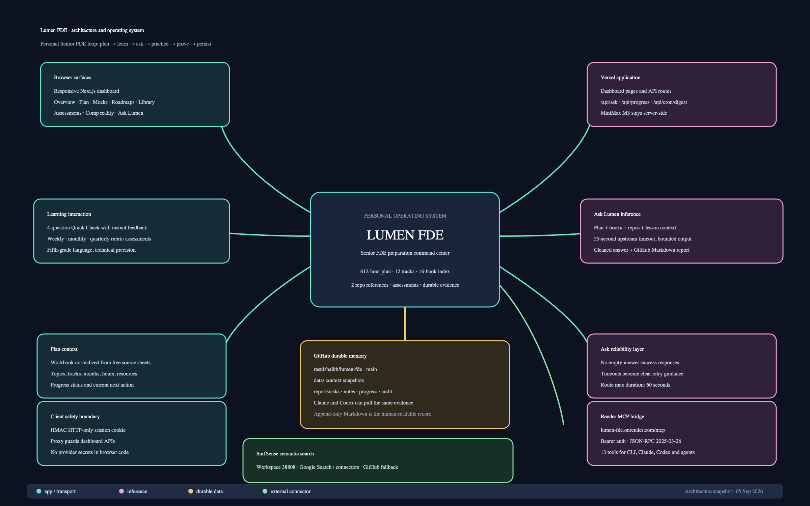

# Lumen FDE: end-to-end architecture

**Snapshot:** 5 September 2026  
**System:** Lumen FDE, Rasul's personal Senior Forward Deployed Engineer preparation operating system  
**Repository:** `rasulshaikh/lumen-fde`  
**Dashboard:** `https://lumen-fde.vercel.app`  
**MCP bridge:** `https://lumen-fde.onrender.com/mcp`



## 1. Executive summary

Lumen FDE turns Rasul's Senior FDE workbook into a working learning system. The browser is the interaction layer. Vercel hosts the dashboard and the MiniMax-backed Ask API. Render hosts the protected MCP bridge so Claude, Codex, and other MCP clients can use the same plan and tools. GitHub is the durable, inspectable memory layer for Ask reports, study notes, progress events, and audit records. SurfSense is the live semantic-search connector. The private PDFs remain local source material; the application receives curated context indexes rather than shipping the books into the browser.

The loop is:

```
Plan → choose a topic → read/watch/build → ask Lumen → recall with a quick check
     → complete weekly/monthly/quarterly evidence → record progress → inspect analytics
```

The system separates three concerns:

1. **Experience:** responsive dashboard, learning views, Ask panel, quizzes, and assessments.
2. **Intelligence:** MiniMax M3 with plan, book, repository, and lesson context; SurfSense for live search.
3. **Evidence:** GitHub-backed Markdown records that can be read by humans, Claude, Codex, and MCP clients.

## 2. What was built today

### Workbook foundation

- Normalized the Senior FDE workbook into `data/workbook.json`.
- Preserved the source workbook as `data/source.xlsx`.
- Modeled the five original workbook areas: Dashboard, Plan, Mocks, Roadmaps, and CompReality.
- Exposed product views: Overview, Plan, Mocks, Roadmaps, Library, Assessments, and Comp reality.
- Added the first structured lesson context for Shell Mastery and Scripting.

### Context layer

- Added a 16-book study-library index in `data/library-context.json`.
- Added repository summaries in `data/repository-context.json` for OpenBot and AI Engineering from Scratch.
- Added `data/lesson-context.json` for structured explanations, exercises, interview angles, and next steps.
- Kept the original PDFs local. Indexed metadata is safe to commit; private files and secrets are not.
- The context is an indexed map, not a claim that the model has memorized every page of every PDF.

### Dashboard and interaction layer

- Built a Lumen visual system using deep ink text, soft blue surfaces, restrained magenta accent, teal status color, and gold data emphasis.
- Made the Lumen mark link to the homepage `/`.
- Added responsive behavior for desktop, laptop, tablet, phablet, and mobile, with portrait and landscape layouts considered.
- Added horizontal overflow treatment for wide plan rows instead of clipping content.
- Added the four-question Quick Check with deterministic key `1B · 2C · 3A · 4D`.
- Added weekly, monthly, and quarterly assessment cards with instructions, rubrics, and answer-key guidance.
- Removed provider branding from the learner-facing Ask panel. The learner sees Lumen, not the underlying model vendor.

### Ask reliability

- Added the server-side MiniMax M3 route at `/api/ask`.
- Added `maxDuration = 60` and a bounded 55-second upstream timeout.
- Added bounded completion tokens and disabled visible model thinking output.
- Added empty-answer protection, clearer upstream error handling, and timeout-specific messages.
- Added a protected internal bridge so Render MCP can call Vercel Ask without exposing the MiniMax key.
- Successful Ask responses are saved as Markdown under `reports/asks/`.

### Durable learning memory

- Added `/api/progress` for append-only progress events.
- Added GitHub-backed Ask reports, notes, progress, and audit paths.
- Added report links so the same answer can be inspected from the dashboard, GitHub, Claude, or Codex.
- Added a daily digest route prepared for Vercel Cron and Resend.

### MCP and search

- Created the protected Render service `lumen-mcp`.
- Implemented JSON-RPC MCP protocol version `2025-03-26` at `/mcp`.
- Added bearer authentication, request-size limits, rate limiting, and audit logging.
- Added 13 tools for context, Ask, reports, notes, progress, assessments, search, auditing, and connection discovery.
- Replaced the planned Exa path with SurfSense Google Search / connector access, with GitHub search as a safe fallback.

## 3. Runtime architecture

### Browser → Vercel dashboard

The user opens `https://lumen-fde.vercel.app`. Next.js renders the learning views and keeps provider credentials on the server. Login uses the configured Lumen username and password, then issues an HMAC-signed HTTP-only session cookie. `proxy.ts` protects application API routes. The logo returns to `/`.

The browser never receives `MINIMAX_API_KEY`, `GITHUB_TOKEN`, `RESEND_API_KEY`, `MCP_API_KEY`, `LUMEN_INTERNAL_API_KEY`, or `SURFSENSE_API_KEY`.

### Dashboard → Ask API → MiniMax M3

```
Ask panel
  → POST /api/ask
  → proxy session check, or internal service-key check
  → assemble plan + indexed library + repos + lesson context
  → MiniMax M3, bounded request
  → clean answer and reject empty output
  → return answer to browser
  → save Markdown report to GitHub
```

The answer contract asks for language a fifth grader can follow while retaining technical accuracy, a Senior FDE connection, an example, and a practical next step. Hidden reasoning and provider details are not shown to the learner.

### MCP → Vercel Ask bridge

```
Claude / Codex / MCP client
  → POST https://lumen-fde.onrender.com/mcp
  → Authorization: Bearer MCP_API_KEY
  → tools/call: ask_lumen
  → Render → Vercel /api/ask with x-lumen-internal-key
  → MiniMax M3
  → answer + GitHub report path
```

Render has a direct MiniMax fallback for cases where the Vercel bridge variables are absent. In the intended deployment, the Vercel bridge is the active path.

### Progress → GitHub

The dashboard POSTs a progress event to `/api/progress`. MCP `record_progress` can do the same from a CLI or agent. Each event becomes Markdown under `reports/progress/`. The dashboard's current topic status remains the source for the live plan view; GitHub is append-only history.

### Semantic search → SurfSense

With `SURFSENSE_API_KEY` and `SURFSENSE_WORKSPACE_ID=38808` on Render, `semantic_search` calls:

```
POST https://api.surfsense.com/workspaces/38808/scrapers/google_search/scrape
```

The service sends the query, language, country, and bounded page count. If SurfSense is unavailable or not configured, the tool falls back to GitHub repository search.

### Scheduled digest

The Vercel Cron route is designed to run daily. It can call MiniMax for a short progress-aware motivation digest and send it with Resend to `shaikhrasul02@gmail.com`. It requires `CRON_SECRET`, `MINIMAX_API_KEY`, `RESEND_API_KEY`, and a verified `RESEND_FROM_EMAIL`. Cron invokes a route on schedule; it is not an always-on worker.

## 4. Data and context model

| Layer | Source | Role |
|---|---|---|
| Plan | `data/workbook.json` | Topics, tracks, months, hours, resources, workbook-derived progress |
| Library | `data/library-context.json` | Curated index of private books and FDE relevance |
| Repositories | `data/repository-context.json` | OpenBot and AI Engineering from Scratch context |
| Lesson | `data/lesson-context.json` | Shell lesson, exercise, interview angle, next step |
| Ask evidence | `reports/asks/` | Prompt, context summary, answer, timestamp, model label |
| Study memory | `reports/notes/` | Explicitly saved notes |
| Progress | `reports/progress/` | Append-only topic status and notes |
| Audit | `reports/audit/` | Durable records for mutating MCP actions |

## 5. MCP tool surface

The Render server exposes:

1. `get_plan` — filter the plan by query, month, or track.
2. `get_learning_context` — read book, repository, and lesson indexes.
3. `ask_lumen` — request a fifth-grade-language technical explanation.
4. `list_ask_reports` — list GitHub Markdown Ask reports.
5. `read_ask_report` — read one saved report by path.
6. `save_study_note` — explicitly save a durable note.
7. `record_progress` — explicitly record a topic status event.
8. `get_progress_history` — list progress events.
9. `get_progress_analytics` — summarize history and recent events.
10. `score_assessment` — score Quick Check or rubric assessments.
11. `semantic_search` — SurfSense search or GitHub fallback.
12. `get_audit_log` — inspect recent MCP actions.
13. `get_connection_map` — return canonical service connections.

Suggested MCP client configuration:

```json
{
  "mcpServers": {
    "lumen-fde": {
      "url": "https://lumen-fde.onrender.com/mcp",
      "headers": {
        "Authorization": "Bearer <MCP_API_KEY>"
      }
    }
  }
}
```

## 6. Assessments and learning controls

Assessments are learning gates, not account locks.

### Quick Check

- Four multiple-choice questions.
- Immediate score and explanation in the UI.
- Current Shell Mastery key: `1B · 2C · 3A · 4D`.
- The UI evaluates the quick interaction locally for speed.
- MCP `score_assessment` provides the authoritative server-side path when an agent needs to score it.

### Weekly checkpoint

Thirty minutes. Close notes, explain one topic, solve two small problems, and write one production lesson. The rubric checks correctness, reasoning, production tradeoffs, and communication.

### Monthly deep dive

Ninety minutes. Combine several plan topics into a design or debugging task. The rubric checks technical depth, tradeoff quality, implementation evidence, and explanation quality.

### Quarterly capstone

Three hours. Build and defend a realistic FDE artifact: architecture, implementation, tests, operations, and customer-facing explanation. The rubric checks end-to-end ownership and evidence.

Currently there are no automatic unlock rules, saved UI assessment scores, pass/fail status, deadline tracking, streak tracking, proof uploads, or submission history. Open-ended answers are evaluated through the rubric and can be sent to Ask Lumen or `score_assessment`. This is an explicit boundary, not a hidden feature.

## 7. Security, reliability, and precaution layers

### Authentication and secrets

- HMAC-signed HTTP-only session cookie for the dashboard.
- Internal service key for Render-to-Vercel Ask calls.
- Bearer API key for Render MCP clients.
- Provider keys are server-side environment variables.
- No secret values belong in GitHub, browser JavaScript, reports, or screenshots.

### Abuse and failure controls

- MCP request body is bounded at 128 KB.
- MCP rate limit is 30 requests per minute per client key.
- Ask requests have a bounded upstream timeout.
- Empty model answers are failures, not successful blank responses.
- Upstream failures become readable retry messages.
- Assessment and progress mutations are explicit; opening a page does not silently change status.

### Auditability

- Successful mutating MCP actions create durable GitHub audit records.
- Recent MCP requests are also held in memory for operational inspection.
- Reports and notes are human-readable Markdown.

## 8. Deployment topology

### GitHub

`https://github.com/rasulshaikh/lumen-fde`

The `main` branch contains the dashboard, MCP service, normalized data, context maps, and durable reports. GitHub is the collaboration surface for Claude and Codex. Runtime Ask side effects may add commits to `reports/asks/`, so pull before local edits.

### Vercel

`https://lumen-fde.vercel.app`

Vercel hosts the Next.js dashboard, API routes, MiniMax Ask path, progress endpoint, and scheduled digest route. The clean URL may be protected by account-level access control in some server-to-server contexts; the service bridge uses a stable deployment alias when required.

### Render

- Service: `lumen-mcp`
- Base URL: `https://lumen-fde.onrender.com`
- Health: `https://lumen-fde.onrender.com/healthz`
- MCP: `https://lumen-fde.onrender.com/mcp`

Render runs the Node MCP service from `mcp/` on the free tier. Auto-deploy follows `main`. The free tier may sleep after inactivity, so the MCP is not guaranteed to be continuously warm. Health checks can reduce cold-start surprises but cannot provide paid-tier always-on guarantees.

### Environment variable groups

Names only, never values:

- **Vercel:** `MINIMAX_API_KEY`, `RESEND_API_KEY`, `RESEND_FROM_EMAIL`, `CRON_SECRET`, `DIGEST_TO_EMAIL`, `LUMEN_USERNAME`, `LUMEN_PASSWORD`, `GITHUB_TOKEN`, `GITHUB_REPO`, `GITHUB_BRANCH`, `LUMEN_INTERNAL_API_KEY`.
- **Render:** `GITHUB_TOKEN`, `GITHUB_REPO`, `GITHUB_BRANCH`, `MCP_API_KEY`, `PUBLIC_MCP_URL`, `LUMEN_ASK_URL`, `LUMEN_INTERNAL_API_KEY`, `SURFSENSE_API_KEY`, `SURFSENSE_API_URL`, `SURFSENSE_WORKSPACE_ID`.
- **Optional fallback:** Render `MINIMAX_API_KEY` is only needed when the Vercel bridge is disabled. Keeping two provider keys increases the security surface; remove the Render copy once the bridge is confirmed stable.

## 9. Verification completed

- Production dashboard was reached at the canonical Lumen URL.
- Render health endpoint was checked.
- Unauthenticated MCP requests return `401`.
- MCP initialization reports protocol `2025-03-26` and server `lumen-mcp`.
- MCP rate limiting was confirmed with `429` after the configured threshold.
- A production Ask through the internal Vercel alias returned a non-empty answer and a GitHub report.
- The Ask panel now renders meaningful timeout or upstream error guidance instead of a generic failure for every error class.
- The repository contains the code and context required for GitHub, Vercel, Render, Claude, Codex, and MCP workflows.

## 10. Known limitations and recommended next work

1. **Progress analytics status parsing:** MCP-created progress filenames currently do not encode status, while analytics infers status from filenames. Store a structured status field or encode status consistently.
2. **Audit durability:** reads and failed requests are primarily in memory. Persist a bounded operational audit stream if historical incident review matters.
3. **Rate-limit scope:** the limiter is process-local and resets when Render restarts. Use Redis or another shared store for multi-instance enforcement.
4. **Path hardening:** reject `..` explicitly in `read_ask_report`, even though GitHub returned Not Found for the tested traversal shape.
5. **CORS tightening:** replace wildcard CORS with known origins if browser-based MCP clients are introduced.
6. **Full retrieval:** ingest actual PDFs and repository content into a retrieval index if page-level citations and deeper cross-book answers are required.
7. **Assessment persistence:** add a database or GitHub score record only if longitudinal scoring, streaks, or proof submissions are wanted.
8. **Always-on MCP:** move Render from free to a paid always-on instance if cold starts are unacceptable.

## 11. Operating runbook

```bash
# Pull durable Ask reports and progress before local work
git pull origin main

# Inspect reports
git ls-tree -r --name-only origin/main reports

# Deploy dashboard changes
vercel --prod

# Inspect Vercel environment names
vercel env ls production

# Check Render MCP health
curl -fsS https://lumen-fde.onrender.com/healthz
```

For a new study session:

1. Open Plan and choose one topic.
2. Read, watch, or build the listed resource.
3. Ask Lumen for a plain-English explanation and a 20-minute exercise.
4. Complete the four-question Quick Check.
5. Save a note only when it is worth keeping.
6. Record progress only when the status genuinely changed.
7. At each assessment cadence, write the answer before opening the rubric.
8. Pull GitHub so Claude or Codex can use the same evidence.

## 12. Design principle

Lumen is not just a dashboard and not just a chatbot. It is an evidence loop. The interface makes the next action obvious. The model makes hard material explainable. Assessments force retrieval. GitHub preserves proof. MCP makes the system available to the tools used to build and operate it. The strongest future version keeps these boundaries clear while adding deeper retrieval and durable evaluation only when the learning workflow proves it needs them.


